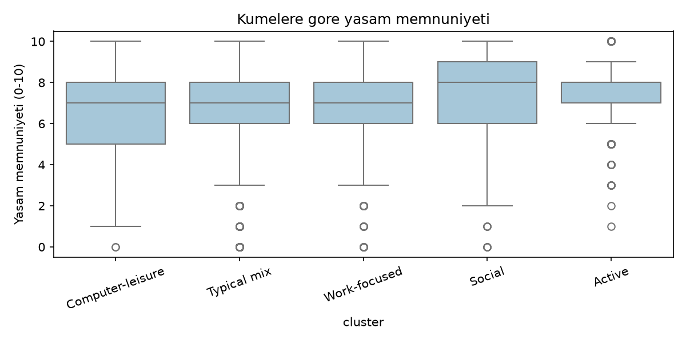

# Zaman Kullanımı ve Yaşam Memnuniyeti

Bu projede insanların gününü nasıl geçirdiğine (uyku, iş, yemek, spor, arkadaşlar, TV, bilgisayar) bakıp bunun yaşam memnuniyetiyle bir ilişkisi var mı diye merak ettim. Kişileri günlük zaman dağılımlarına göre K-Means ile gruplara ayırdım, sonra grupların memnuniyetini karşılaştırdım.

Kişisel bir veri analizi projesi, YBS öğrencisi olarak Python ve clustering pratiği yapmak için hazırladım.

## Veri

ABD'nin [ATUS](https://www.bls.gov/tus/) (American Time Use Survey) verisinin 2013 Well-Being modülünü kullandım. Katılımcılar bir günlerini dakika dakika kaydediyor ve 0-10 arası bir yaşam memnuniyeti sorusuna cevap veriyor. Temizlikten sonra **10.378 kişi** kaldı.

Ham dosyalar `data/raw/` klasöründe, BLS sitesinden indirdim:

- `atussum_2013.dat`: kişi başı aktivite süreleri
- `atusresp_2013.dat`: katılımcı bilgileri
- `wbresp_2013.dat`: well-being cevapları (memnuniyet sorusu burada)

Bu dosyalar silinirse kod otomatik olarak sentetik veri üretiyor, böylece pipeline yine de denenebiliyor (ama o sonuçlar gerçek değil).

## Ne yaptım?

1. **Veri hazırlama:** ATUS'taki aktivite kodlarını 7 kategoriye topladım ve kişi başı günlük saate çevirdim (`src/config.py`).
2. **Keşifsel analiz:** ortalamalar, hafta içi / hafta sonu farkı, korelasyonlar.
3. **Clustering:** verileri standardize edip K-Means uyguladım. k'yı elbow ve silhouette ile seçtim, k = 5 çıktı.
4. **Karşılaştırma:** gruplar arası memnuniyet farkına Kruskal-Wallis ile baktım, sonra yaş, cinsiyet ve hafta sonunu kontrol eden basit bir regresyon kurdum.

## Sonuçlar

Ortalama bir günde insanlar ~8.8 saat uyuyor, ~3 saat TV izliyor, ~2.5 saat çalışıyor (çalışmayanlar da dahil olduğu için düşük). Hafta sonu iş saati 4 saatten 1 saate düşüyor, uyku ve TV artıyor.

Çıkan 5 grup:

| Grup | Kişi sayısı | Öne çıkan | Ort. memnuniyet |
|---|---|---|---|
| Active | 336 | günde ~4.4 saat spor | 7.40 |
| Social | 1011 | günde ~4.4 saat arkadaşlarla | 7.24 |
| Work-focused | 2847 | günde ~8.4 saat iş | 7.15 |
| Typical mix | 5962 | belirgin bir şey yok, TV biraz fazla | 7.08 |
| Computer-leisure | 222 | boş zamanda ~4.2 saat bilgisayar | 6.57 |



- Gruplar arasındaki fark istatistiksel olarak anlamlı (Kruskal-Wallis p < 0.001).
- Yaş ve cinsiyet kontrol edildiğinde de en mutlu grup "Active", en düşük grup "Computer-leisure" çıktı.
- **Ama fark küçük.** Regresyonun R² değeri sadece 0.006, yani zaman kullanımı memnuniyetteki farkın çok küçük bir kısmını açıklıyor. Tek tek korelasyonlar da hep 0.1'in altında.
- Hafta sonu olup olmamasının memnuniyete bir etkisi çıkmadı.

Kısacası "spor yapan ve sosyalleşen insanlar biraz daha memnun" gibi bir eğilim var, ama çok güçlü bir ilişki değil.

## Sınırlılıklar

- Bu bir korelasyon, nedensellik değil. Spor yapmak insanı mutlu ediyor olabilir, ya da mutlu insanlar daha çok spor yapıyor olabilir.
- ATUS her kişiden sadece bir günlük kayıt alıyor, o gün kişinin normal günü olmayabilir.
- ATUS'ta "sosyal medya" diye bir kategori yok, yerine boş zamanda bilgisayar kullanımını aldım. Yaklaşık bir karşılık.
- Veri ABD'den ve 2013 yılından, Türkiye'ye veya bugüne genellemek zor.

## Çalıştırma

```bash
pip install -r requirements.txt
cd notebooks
jupyter notebook
```

Notebook'ları sırayla çalıştır: `01_data_prep` → `02_eda` → `03_clustering` → `04_wellbeing_analysis`. Grafikler `figures/` klasörüne kaydediliyor.

## Klasörler

```text
src/            veri yükleme, sentetik veri, basit OLS fonksiyonu
notebooks/      4 adımlık analiz
notebooks_src/  notebook'ların .py hali + build.py (bunlardan .ipynb üretiyor)
figures/        grafikler
data/processed/ işlenmiş veri
```

## Kullandıklarım

Python, pandas, scikit-learn, scipy, matplotlib, seaborn, Jupyter
